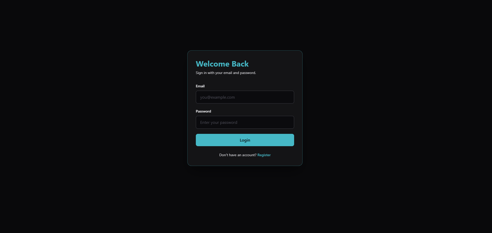
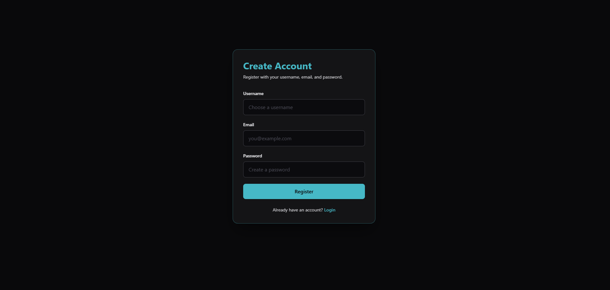
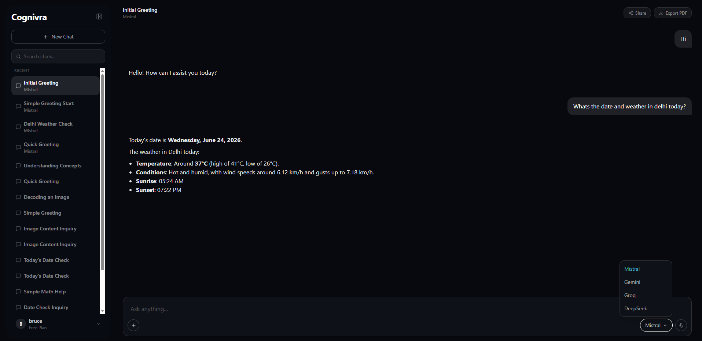
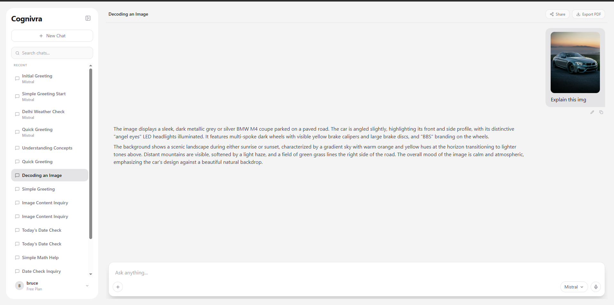
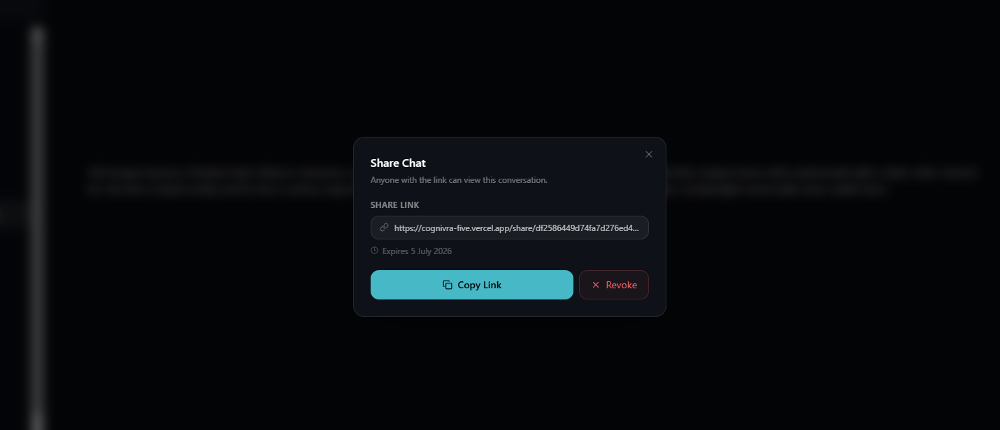
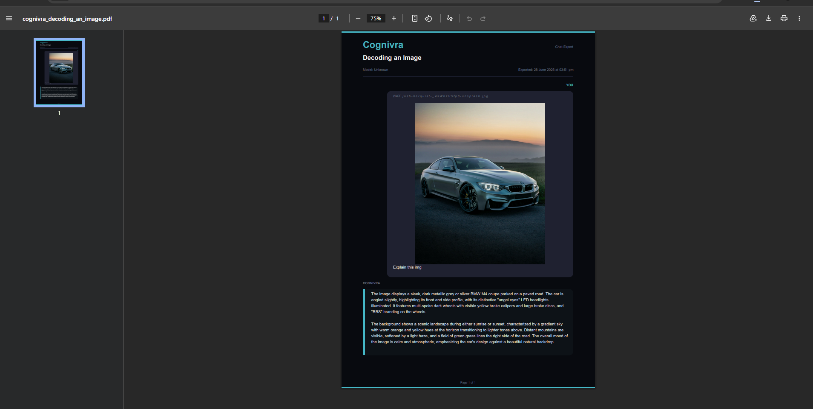
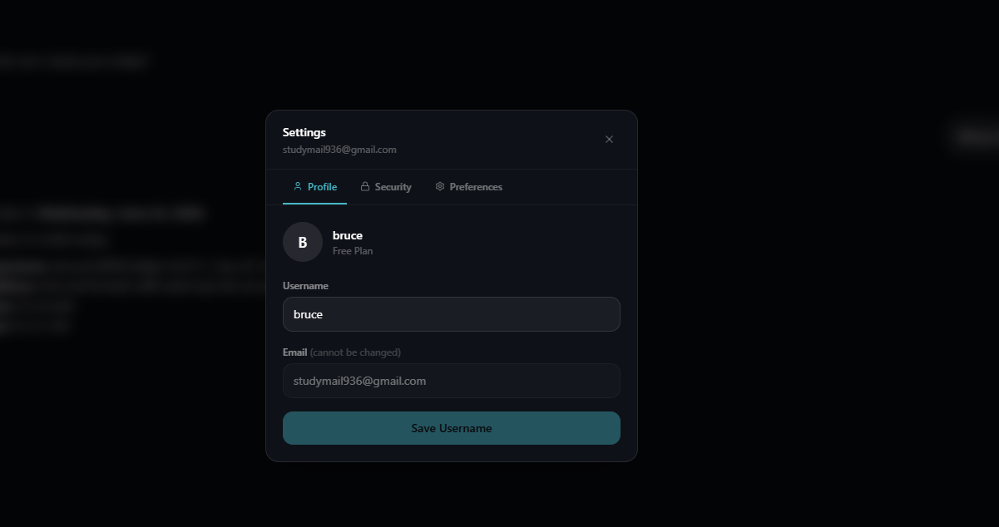
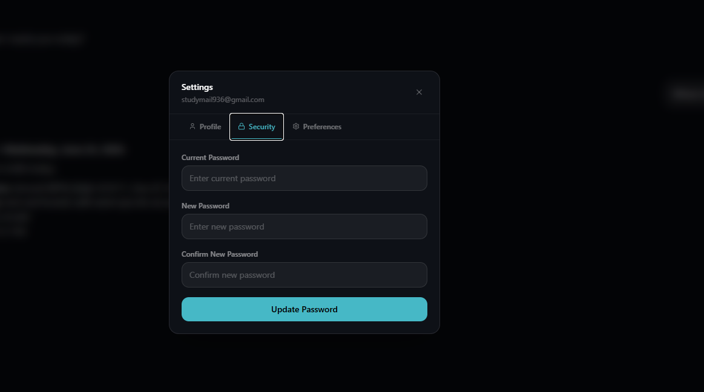
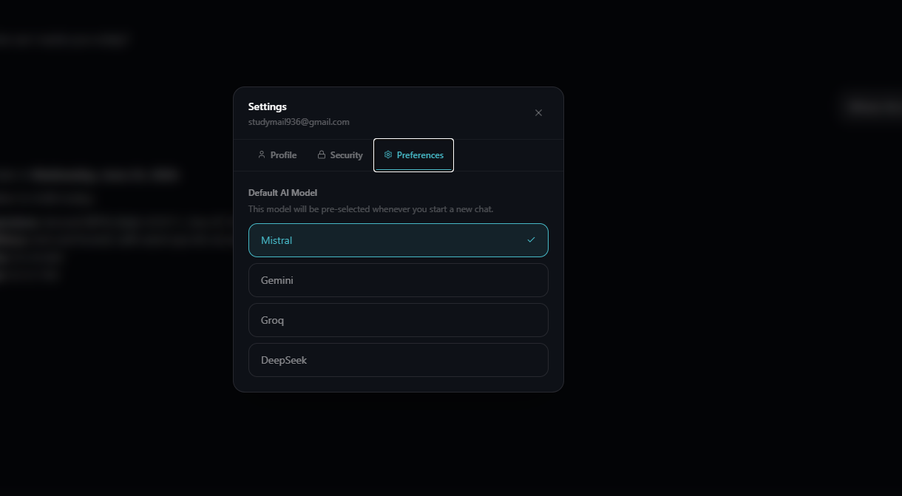
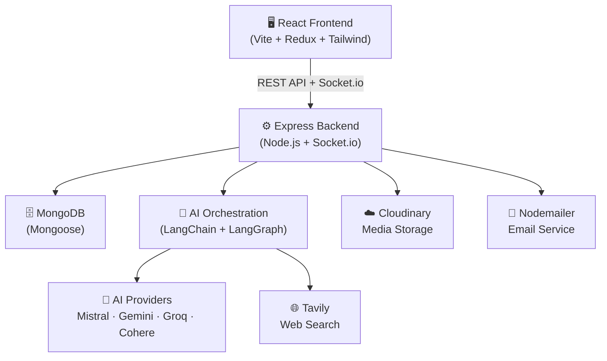

<div align="center">

# 🧠 Cognivra

**An AI-powered chat platform with multi-model support, real-time messaging, web search, and PDF export.**

[](https://cognivra-five.vercel.app)
[](https://react.dev)
[](https://nodejs.org)
[](https://mongodb.com)
[](./LICENSE)

</div>

---

## 📸 Screenshots

### Login & Register
| Login | Register |
|---|---|
|  |  |

### Dashboard
| Dark Mode | Light Mode |
|---|---|
|  |  |

### Share Chat & PDF Export
| Share Chat | PDF Export |
|---|---|
|  |  |

### Settings
| Profile | Security | Preferences |
|---|---|---|
|  |  |  |

---

## ✨ Features

- 🤖 **Multi-Model AI** — Switch between Mistral, Gemini, Groq, and DeepSeek per chat
- 🌐 **Web Search** — Real-time internet search via Tavily, grounding AI responses in current data
- 💬 **Chat Management** — Persistent history with search, hide, and delete
- 🔗 **Shareable Chats** — Generate time-limited public links for any conversation
- 📤 **PDF Export** — Export conversations as branded, formatted PDFs
- 🎨 **Dark & Light Mode** — Full theme support with user preference persistence
- ⚙️ **Model Preferences** — Set a default AI model per account
- 🔐 **Authentication** — JWT-based auth with secure password hashing and change flow
- ☁️ **Media Uploads** — Image and file uploads via Cloudinary
- 📧 **Email Notifications** — Transactional email via Nodemailer + Gmail OAuth
- ⚡ **Real-time Updates** — Socket.io for live chat events

---

## 🏗️ Architecture



---

## 🛠️ Tech Stack

### Frontend
| Technology | Version | Purpose |
|---|---|---|
| React + Vite | 19 / 7 | UI framework & build tool |
| Redux Toolkit | 2.x | Global state management |
| React Router | v7 | Client-side routing |
| Tailwind CSS | v4 | Styling & theming |
| Socket.io Client | 4.x | Real-time communication |
| Axios | 1.x | HTTP requests |
| jsPDF | 4.x | PDF export |
| React Markdown | 10.x | Markdown rendering in chat |
| Sonner | 2.x | Toast notifications |

### Backend
| Technology | Version | Purpose |
|---|---|---|
| Node.js + Express | 18+ / v5 | Server framework |
| MongoDB + Mongoose | 9.x | Database & ODM |
| Socket.io | 4.x | Real-time events |
| LangChain + LangGraph | 1.x | AI orchestration & agent graphs |
| Mistral / Gemini / Groq / Cohere | — | AI model providers |
| Tavily | 0.7.x | Web search API |
| Cloudinary | 2.x | Media storage & delivery |
| JWT + bcryptjs | — | Auth & password hashing |
| Nodemailer | 8.x | Email delivery |
| express-validator | 7.x | Input validation |

---

## 📁 Project Structure

```
Cognivra/
├── Backend/
│   ├── .env.example
│   └── src/
│       ├── config/          # Database connection
│       ├── controllers/     # auth, chat, user — request handlers
│       ├── middleware/      # JWT auth guard
│       ├── models/          # Mongoose schemas: User, Chat, Message
│       ├── routes/          # REST route definitions
│       ├── services/        # ai, cloudinary, internet (Tavily), mail
│       ├── sockets/         # Socket.io event handlers
│       ├── validators/      # express-validator rule sets
│       ├── app.js           # Express app setup
│       └── server.js        # Entry point
│
└── Frontend/
    └── src/
        ├── app/             # Redux store & route config
        ├── features/
        │   ├── auth/        # Login, Register pages + slice + API
        │   └── chat/        # Dashboard, SharedChat, UserSettings
        └── main.jsx
```

---

## 🚀 Getting Started

### Prerequisites

| Requirement | Notes |
|---|---|
| Node.js v18+ | [Download](https://nodejs.org) |
| MongoDB | Local or [Atlas free tier](https://www.mongodb.com/atlas) |
| At least one AI provider key | Gemini, Mistral, Groq, or Cohere |
| Tavily API key | [Free tier available](https://tavily.com) |
| Cloudinary account | [Free tier available](https://cloudinary.com) |

---

### 1. Clone the Repository

```bash
git clone https://github.com/your-username/cognivra.git
cd cognivra
```

### 2. Backend Setup

```bash
cd Backend
npm install
cp .env.example .env   # then fill in your values
npm run dev            # starts on http://localhost:3000
```

### 3. Frontend Setup

```bash
cd ../Frontend
npm install
```

Create `Frontend/.env`:

```env
VITE_API_URL=http://localhost:3000
```

```bash
npm run dev            # starts on http://localhost:5173
```

---

## 🔑 Environment Variables

Copy `Backend/.env.example` to `Backend/.env` and fill in the values below.

```env
# Server
PORT=3000

# Database
MONGODB_URI=""              # MongoDB connection string

# Auth
JWT_SECRET=""               # Any long random string

# Google OAuth — used by Nodemailer for Gmail delivery
GOOGLE_CLIENT_ID=""
GOOGLE_CLIENT_SECRET=""
GOOGLE_REFRESH_TOKEN=""

# AI Providers — at least one required
GEMINI_API_KEY=""
MISTRAL_API_KEY=""
GROQ_API_KEY=""
COHERE_API_KEY=""

# Web Search
TAVILY_API_KEY=""

# Cloudinary — image & file uploads
CLOUDINARY_CLOUD_NAME=""
CLOUDINARY_API_KEY=""
CLOUDINARY_API_SECRET=""

# CORS — set to your frontend URL in production
FRONTEND_URL=""
```

> 💡 Only one AI provider key is required for chat to function. All four can be configured simultaneously so users can switch between them.

---

## 📦 Scripts

### Backend

| Command | Description |
|---|---|
| `npm run dev` | Start with nodemon (hot reload) |

### Frontend

| Command | Description |
|---|---|
| `npm run dev` | Vite dev server |
| `npm run build` | Production build |
| `npm run preview` | Preview production build locally |
| `npm run lint` | Run ESLint |

---

## 🌍 Deployment

| Layer | Platform | Notes |
|---|---|---|
| Frontend | [Vercel](https://vercel.com) | Set `VITE_API_URL` to your backend URL |
| Backend | [Render](https://render.com) / [Railway](https://railway.app) | Set all env vars in the platform dashboard |
| Database | [MongoDB Atlas](https://mongodb.com/atlas) | Whitelist your backend server IP |

**Important:** Set `FRONTEND_URL` in your backend environment to your Vercel deployment URL to allow CORS.

---

## 🔌 API Overview

| Method | Endpoint | Description | Auth |
|---|---|---|---|
| POST | `/api/auth/register` | Register new user | ❌ |
| POST | `/api/auth/login` | Login & receive JWT | ❌ |
| GET | `/api/chat` | Fetch all user chats | ✅ |
| POST | `/api/chat` | Create new chat | ✅ |
| POST | `/api/chat/:id/message` | Send message to AI | ✅ |
| GET | `/api/chat/share/:token` | View shared chat (public) | ❌ |
| PATCH | `/api/user/settings` | Update profile/preferences | ✅ |

> Full API details can be explored via the codebase in `Backend/src/routes/`.

---

## 🤝 Contributing

Contributions are welcome! To get started:

1. Fork the repository
2. Create a feature branch: `git checkout -b feat/your-feature`
3. Commit your changes: `git commit -m "feat: add your feature"`
4. Push and open a Pull Request

Please follow existing code style and keep PRs focused.

---

## 📄 License

This project is licensed under the [ISC License](./LICENSE).

---

<div align="center">
Built with ❤️ using React, Node.js, and LangChain
</div>
